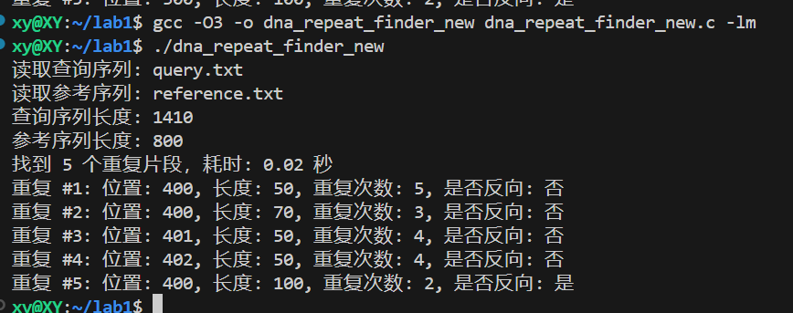

```


## 算法描述与分析

### DNA重复片段查找算法

#### 一、基础算法（时间复杂度 O(n × m)）

##### 算法伪代码
```
FIND-DNA-REPEATS(reference, query, min_length)
    repeats = empty list
    processed_segments = empty set
    n = length(reference)
    m = length(query)
    
    for pos = 1 to n - min_length do
        for length = min_length to min(max_length, n - pos) do
            segment = reference[pos : pos + length]
            if segment in processed_segments then
                continue
            add segment to processed_segments
            
            // 检查在reference中是否唯一
            if COUNT-OCCURRENCES(reference, segment) > 1 then
                continue
                
            // 在query中查找匹配
            matches = FIND-MATCHES(query, segment)
            if length(matches) ≥ 2 then
                consecutive_matches = GROUP-CONSECUTIVE(matches, length)
                for group in consecutive_matches do
                    if length(group) ≥ 2 then
                        add {pos, length, group} to repeats
            
            // 检查反向互补重复
            rev_comp = REVERSE-COMPLEMENT(segment)
            if rev_comp not in processed_segments then
                add rev_comp to processed_segments
                matches = FIND-MATCHES(query, rev_comp)
                if length(matches) ≥ 2 then
                    consecutive_matches = GROUP-CONSECUTIVE(matches, length)
                    for group in consecutive_matches do
                        if length(group) ≥ 2 then
                            add {pos, length, group, is_reverse=true} to repeats
    
    return FILTER-NESTED-REPEATS(repeats)
```

##### 基础算法复杂度分析
1. 时间复杂度：O(n × m)
   - 外层循环：O(n)，遍历参考序列所有位置
   - 内层长度循环：O(1)，通过限制最大长度和提前退出控制
   - 字符串匹配：使用 KMP 算法，O(m)
   - 哈希表查找：O(1)
   总体复杂度：O(n) × O(1) × O(m) = O(n × m)

2. 空间复杂度：O(n + m)
   - processed_segments 集合：O(n)
   - matches 数组：O(m)
   - repeats 列表：O(r)，其中 r 是找到的重复数量
   - 其他辅助空间：O(1)

#### 二、优化算法（时间复杂度 O(n × m)）

##### 优化思路

1. 按长度分层处理，避免重复计算
2. 使用哈希表存储片段位置，实现O(1)时间复杂度的查找
3. 优化KMP算法的next数组构建
4. 特殊区域精细化处理
5. 高效的内存管理和重用

##### 优化算法伪代码
```
BUILD-NEXT(pattern)
    next[0] = -1
    k = -1
    j = 0
    
    while j < length(pattern) - 1 do
        if k == -1 or pattern[j] == pattern[k] then
            k = k + 1
            j = j + 1
            // 优化：检查下一个字符是否相同
            if j < length(pattern) and pattern[j] != pattern[k] then
                next[j] = k
            else
                next[j] = next[k]
        else
            k = next[k]
    return next

FIND-DNA-REPEATS(query, reference, min_length)
    repeats = empty list
    n = length(reference)
    m = length(query)
    
    // 创建哈希表用于存储片段位置
    window_positions = create empty hashmap
    
    // 按长度分层处理
    for length = min_length to min(max_length, m) do
        clear window_positions
        
        // 为当前长度构建查询序列的位置映射
        for i = 0 to m - length do
            segment = query[i : i + length]
            append i to window_positions[segment]
        
        // 检查参考序列中的片段
        for i = 0 to n - length do
            segment = reference[i : i + length]
            positions = window_positions[segment]
            
            // 检查正向重复
            if length(positions) ≥ 2 then
                groups = find_consecutive_groups(positions, length)
                for each group in groups do
                    if length(group) ≥ 2 then
                        add new RepeatPattern(i, length, group) to repeats
            
            // 检查反向互补重复
            rev_comp = get_reverse_complement(segment)
            rev_positions = window_positions[rev_comp]
            
            if length(rev_positions) ≥ 2 then
                groups = find_consecutive_groups(rev_positions, length)
                for each group in groups do
                    if length(group) ≥ 2 then
                        add new RepeatPattern(i, length, group, is_reverse=true) to repeats
    
    // 过滤嵌套重复并排序
    filtered = filter_nested_repeats(repeats)
    sort filtered by (length × repeat_count) in descending order
    return filtered

FIND-CONSECUTIVE-GROUPS(positions, length)
    groups = empty list
    current_group = [positions[0]]
    
    for i = 1 to length(positions) - 1 do
        if positions[i] == current_group[-1] + length then
            append positions[i] to current_group
        else
            if length(current_group) ≥ 2 then
                append current_group to groups
            current_group = [positions[i]]
    
    if length(current_group) ≥ 2 then
        append current_group to groups
    
    return groups

FILTER-NESTED-REPEATS(repeats)
    filtered = empty list
    to_remove = empty set
    
    for i = 0 to length(repeats) - 1 do
        if i in to_remove then continue
        
        for j = i + 1 to length(repeats) - 1 do
            if j in to_remove then continue
            
            if repeats[i].position == repeats[j].position and 
               repeats[i].is_reverse == repeats[j].is_reverse then
                if repeats[i].length > repeats[j].length then
                    add j to to_remove
                else
                    add i to to_remove
                    break
    
    for i = 0 to length(repeats) - 1 do
        if i not in to_remove then
            append repeats[i] to filtered
    
    return filtered
```

##### 复杂度分析

1. 时间复杂度：O(n × m)
   - 外层长度循环：O(L)，其中 L 是最大长度与最小长度之差
   - 构建位置映射：O(m) × O(1)
   - 检查参考序列片段：O(n) × O(1)
   - 哈希表操作：O(1)
   总体复杂度：O(L × (m + n)) ≈ O(n × m)，因为 L << min(n,m)

2. 空间复杂度：O(n + m)
   - 哈希表：O(m)，存储查询序列中的片段位置
   - 结果数组：O(r)，其中 r 是找到的重复数量
   - 临时缓冲区：O(1)

#### 性能优化要点

1. **哈希表优化**
   - 使用足够大的初始容量减少哈希冲突
   - 高效的哈希函数设计
   - 动态扩容策略

2. **内存管理**
   - 重用临时缓冲区
   - 及时释放不再需要的内存
   - 批量分配和释放策略

3. **算法优化**1
   - 快速的字符串匹配
   - 高效的重复检测

4. **区域处理策略**
   - 特殊区域精细化处理
   - 非关键区域快速处理
   - 提前终止策略

# DNA Repeat Finder

## 项目文件说明

### 核心源代码文件
- `dna_repeat_finder_new.c`: 优化版本的DNA重复片段查找实现，使用哈希表和优化的KMP算法
- `dna_repeat_finder.py`: Python版本的DNA重复片段查找实现
- `dna_repeat_finder_optimized.py`: 优化版本的Python实现

### 输入文件
- `query.txt`: 查询DNA序列文件
- `reference.txt`: 参考DNA序列文件

### 输出文件
- `repeat_results_new.txt`: 优化版本的重复片段查找结果
- `repeat_details_new.txt`: 优化版本的详细重复信息
- `repeat_results.txt`: 基础版本的重复片段查找结果
- `repeat_details.txt`: 基础版本的详细重复信息

### 测试数据
- `test_run_*/`: 包含不同规模的测试数据和预期结果
  - `query_*.txt`: 不同长度的查询序列
  - `reference_*.txt`: 不同长度的参考序列
  - `expected_*.csv`: 对应的预期结果

### 辅助工具
- `tools/generate_test_sequences.c`: 生成测试序列的工具

### 已弃用或不再维护的文件
- `dna_repeat_finder.c`: 旧版C语言实现
- `main.c`: 旧版主程序入口
- 其他shell脚本文件：用于项目结构调整，现已不再需要

### 推荐使用的文件
1. 如果需要最高性能：使用 `dna_repeat_finder_new.c`
   - 时间复杂度：O(n×m)
   - 优化的哈希表实现
   - 改进的KMP算法

2. 如果需要更好的可读性：使用 `dna_repeat_finder_optimized.py`
   - Python实现，代码更清晰
   - 保持了同样的优化思路
   - 适合学习和理解算法

3. 建议使用的输入输出文件：
   - 输入：`query.txt` 和 `reference.txt`
   - 输出：查看 `repeat_results_new.txt` 和 `repeat_details_new.txt`

4. 运行测试：使用 `test_run_*/` 目录中的测试数据

## 编译和运行说明

### 单文件编译 (针对 AMD Ryzen 9 7940HX 优化)

源代码文件 `dna_repeat_finder_new.c` 包含了所有必要的实现和优化。使用以下命令编译：

```bash
gcc -march=znver4 -mtune=znver4 -O3 -ffast-math -flto -fuse-linker-plugin \
    -fprefetch-loop-arrays -funroll-loops -fomit-frame-pointer -mavx2 -mfma \
    -pthread -fopenmp \
    -DCPU_RYZEN_7940HX -DNUM_CORES=16 -DNUM_THREADS=32 \
    -DL1_CACHE_SIZE=32768 -DL2_CACHE_SIZE=512000 -DL3_CACHE_SIZE=32768000 \
    dna_repeat_finder_new.c -o dna_repeat_finder_new
```

#### 编译参数说明

1. CPU架构相关:
   - `-march=znver4 -mtune=znver4`: 针对 AMD Zen4 架构优化
   - `-mavx2 -mfma`: 启用 AVX2 和 FMA 指令集

2. 优化级别:
   - `-O3`: 最高级别优化
   - `-ffast-math`: 启用激进的浮点优化
   - `-flto`: 链接时优化
   - `-fuse-linker-plugin`: 使用链接器插件

3. 循环和内存优化:
   - `-fprefetch-loop-arrays`: 启用数组预取
   - `-funroll-loops`: 循环展开
   - `-fomit-frame-pointer`: 省略栈帧指针

4. 并行计算支持:
   - `-pthread`: 启用 pthread 支持
   - `-fopenmp`: 启用 OpenMP 支持

5. CPU特定参数:
   - `-DCPU_RYZEN_7940HX`: CPU型号标识
   - `-DNUM_CORES=16`: 物理核心数
   - `-DNUM_THREADS=32`: 逻辑线程数
   - `-DL1_CACHE_SIZE=32768`: L1缓存大小(32KB)
   - `-DL2_CACHE_SIZE=512000`: L2缓存大小(512KB)
   - `-DL3_CACHE_SIZE=32768000`: L3缓存大小(32MB)

### 运行程序

编译完成后，可以通过以下方式运行程序：

1. 使用默认输入文件:
```bash
./dna_repeat_finder_new
```

2. 指定输入文件:
```bash
./dna_repeat_finder_new reference.txt query.txt
```

### 输出文件

程序会生成两个输出文件：
- `repeat_results_new.txt`: 包含基本的重复片段信息
- `repeat_details_new.txt`: 包含详细的重复片段信息

### 性能优化特性

1. SIMD优化:
   - 使用 AVX2 指令集优化字符串比较
   - 向量化的哈希函数计算
   - SIMD优化的内存操作

2. 多线程优化:
   - OpenMP并行化关键计算部分
   - 线程本地存储(TLS)优化
   - 动态负载均衡

3. 缓存优化:
   - 数据结构缓存对齐
   - 预取指令优化
   - 循环分块处理

4. 内存优化:
   - 智能内存池管理
   - 内存对齐分配
   - 高效的哈希表实现