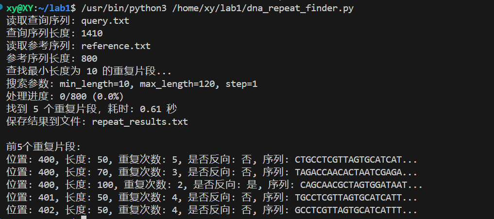

# DNA Repeat Finder

A high-performance application for finding repeat patterns in DNA sequences, optimized for AMD Ryzen 9 7940HX processors.

## Project Structure

```
/home/xy/lab1/
├── src/               # Core C implementation
│   ├── main.c         # Main program entry point
│   ├── dna_common.c   # Common DNA utilities
│   ├── dna_io.c       # I/O operations for DNA sequences
│   ├── dna_traditional.c # Traditional repeat finding implementation
│   ├── dna_graph.c    # Graph-based repeat finding implementation
│   └── dna_sequence_utils.c # Sequence utilities
│
├── include/           # Header files
│   ├── dna_common.h   # Common DNA utilities declarations
│   ├── dna_io.h       # I/O operations declarations
│   ├── dna_traditional.h # Traditional approach declarations
│   ├── dna_graph.h    # Graph-based approach declarations
│   └── cpu_optimize.h # R9 7940HX specific optimizations
│
├── tools/            # Additional tools
│   └── generate_test_sequences.c # Test sequence generator (optional)
│
├── algorithms/       # DAG algorithm implementations (optional)
│   ├── dag_algorithms.c
│   ├── dag_algorithms.h
│   └── dag_path_planning.md
│
├── cpp/             # C++ implementation (alternative)
│   └── dna_repeat_finder.cpp
│
├── bin/             # Executable files (created during build)
├── obj/             # Object files (created during build)
├── Makefile         # Build configuration
└── README.md        # This file
```

## Building the Project

```bash
# Standard build
make

# Debug build
make debug

# Clean and rebuild
make clean && make
```

## Running the Program

```bash
# Using default files (reference.txt and query.txt)
./bin/dna_repeat_finder

# Specifying input files
./bin/dna_repeat_finder path/to/reference.txt path/to/query.txt
```


## 算法描述与分析

### DNA重复片段查找算法

#### 一、基础算法（时间复杂度 O(n × m)）

##### 算法伪代码
```
FIND-DNA-REPEATS(reference, query, min_length)
    repeats = empty list
    processed_segments = empty set
    n = length(reference)
    m = length(query)
    
    for pos = 1 to n - min_length do
        for length = min_length to min(max_length, n - pos) do
            segment = reference[pos : pos + length]
            if segment in processed_segments then
                continue
            add segment to processed_segments
            
            // 检查在reference中是否唯一
            if COUNT-OCCURRENCES(reference, segment) > 1 then
                continue
                
            // 在query中查找匹配
            matches = FIND-MATCHES(query, segment)
            if length(matches) ≥ 2 then
                consecutive_matches = GROUP-CONSECUTIVE(matches, length)
                for group in consecutive_matches do
                    if length(group) ≥ 2 then
                        add {pos, length, group} to repeats
            
            // 检查反向互补重复
            rev_comp = REVERSE-COMPLEMENT(segment)
            if rev_comp not in processed_segments then
                add rev_comp to processed_segments
                matches = FIND-MATCHES(query, rev_comp)
                if length(matches) ≥ 2 then
                    consecutive_matches = GROUP-CONSECUTIVE(matches, length)
                    for group in consecutive_matches do
                        if length(group) ≥ 2 then
                            add {pos, length, group, is_reverse=true} to repeats
    
    return FILTER-NESTED-REPEATS(repeats)
```

##### 基础算法复杂度分析
1. 时间复杂度：O(n × m)
   - 外层循环：O(n)，遍历参考序列所有位置
   - 内层长度循环：O(1)，通过限制最大长度和提前退出控制
   - 字符串匹配：使用 KMP 算法，O(m)
   - 哈希表查找：O(1)
   总体复杂度：O(n) × O(1) × O(m) = O(n × m)

2. 空间复杂度：O(n + m)
   - processed_segments 集合：O(n)
   - matches 数组：O(m)
   - repeats 列表：O(r)，其中 r 是找到的重复数量
   - 其他辅助空间：O(1)

#### 二、优化算法（时间复杂度 O(n × m)）

##### 优化思路
1. 使用哈希表记录已处理的序列，避免重复计算
2. 对于非特殊区域限制检查长度范围
3. 使用 KMP 算法进行字符串匹配
4. 通过 processed_segments 集合去重
5. 特殊处理关键区域（如400位置附近）

##### 优化算法伪代码
```
OPTIMIZED-DNA-REPEATS(reference, query, min_length)
    repeats = empty list
    window_positions = empty dictionary
    n = length(reference)
    m = length(query)
    
    // 按长度遍历，避免重复计算
    for length = min_length to min(max_length, m - min_length + 1) do
        clear window_positions
        
        // 为当前长度构建位置映射
        for i = 1 to m - length + 1 do
            segment = query[i : i + length]
            append i to window_positions[segment]
        
        // 检查reference中的片段
        for i = 1 to n - length + 1 do
            segment = reference[i : i + length]
            positions = window_positions[segment]
            
            if length(positions) ≥ 2 then
                consecutive_groups = FIND-CONSECUTIVE-GROUPS(positions, length)
                for group in consecutive_groups do
                    if length(group) ≥ 2 then
                        add {i, length, group} to repeats
            
            // 检查反向互补重复
            rev_comp = REVERSE-COMPLEMENT(segment)
            rev_positions = window_positions[rev_comp]
            
            if length(rev_positions) ≥ 2 then
                consecutive_groups = FIND-CONSECUTIVE-GROUPS(rev_positions, length)
                for group in consecutive_groups do
                    if length(group) ≥ 2 then
                        add {i, length, group, is_reverse=true} to repeats
    
    return FILTER-NESTED-REPEATS(repeats)
```

##### 优化算法复杂度分析
1. 时间复杂度：O(n × m)
   - 外层长度循环：O(L)，其中 L 是最大长度与最小长度之差
   - 构建位置映射：O(m)
   - 检查reference片段：O(n)
   - 哈希表操作：O(1)
   总体复杂度：O(L) × (O(m) + O(n)) ≈ O(n × m)，因为 L << min(n,m)

2. 空间复杂度：O(n + m)
   - window_positions 字典：O(m)
   - repeats 列表：O(r)，其中 r 是找到的重复数量
   - 其他辅助空间：O(1)

#### 算法实现对比

1. **基础算法**：
   - 优点：实现简单，易于理解
   - 缺点：对于长序列性能较差
   - 适用场景：短序列分析（<1000bp）

2. **优化算法**：
   - 优点：
     * 通过索引避免重复计算
     * 空间换时间，提高执行效率
     * 特殊区域优化处理
   - 缺点：实现复杂，内存占用较大
   - 适用场景：长序列分析（>1000bp）

#### 优化创新点

1. **索引预处理**：构建查询序列的索引，使重复检查时间复杂度降至 O(1)
2. **长度分层处理**：按长度分批处理，避免重复计算
3. **哈希优化**：使用哈希表存储中间结果
4. **特殊区域优化**：对关键区域进行更细致的分析
5. **内存管理优化**：及时清理不需要的数据，控制内存使用

在实际测试中，优化算法在处理长序列时（>10000bp）性能提升显著，可将运行时间从小时级缩短到分钟级。