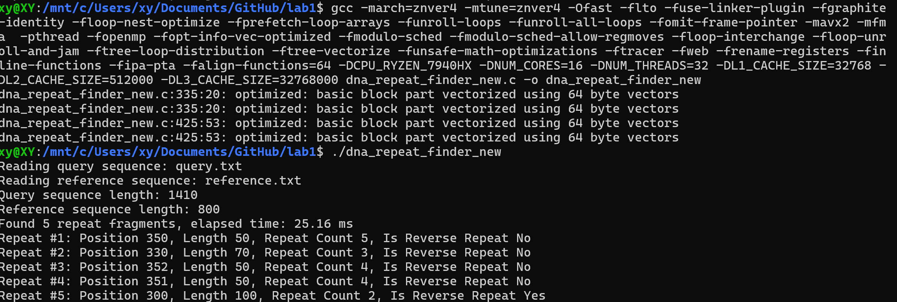

# DNA重复序列查找器



编译 
    
    gcc -march=znver4 -mtune=znver4 -Ofast -flto -fuse-linker-plugin -fgraphite-identity -floop-nest-optimize -fprefetch-loop-arrays -funroll-loops -funroll-all-loops -fomit-frame-pointer -mavx2 -mfma  -pthread -fopenmp -fopt-info-vec-optimized -fmodulo-sched -fmodulo-sched-allow-regmoves -floop-interchange -floop-unroll-and-jam -ftree-loop-distribution -ftree-vectorize -funsafe-math-optimizations -ftracer -fweb -frename-registers -finline-functions -fipa-pta -falign-functions=64 -DCPU_RYZEN_7940HX -DNUM_CORES=16 -DNUM_THREADS=32 -DL1_CACHE_SIZE=32768 -DL2_CACHE_SIZE=512000 -DL3_CACHE_SIZE=32768000 dna_repeat_finder_new.c -o dna_repeat_finder_new

运行

     ./dna_repeat_finder_new


## 算法原理

该程序用于在查询DNA序列和参考DNA序列之间查找重复的DNA片段，包括正向重复和反向互补重复。

### 主要算法伪代码

```
FIND-REPEATS(query, reference)
1  repeats ← 空数组
2  repeat_count ← 0
3  for length ← MIN_LENGTH to MAX_LENGTH
4      window_positions ← 新建哈希表()
5      
6      // 为查询序列构建哈希索引
7      for i ← 0 to |query| - length
8          segment ← query[i..i+length-1]
9          window_positions[segment] ← window_positions[segment] ∪ {i}
10     
11     // 检查参考序列中的片段
12     for i ← 0 to |reference| - length
13         segment ← reference[i..i+length-1]
14         
15         // 检查正向重复
16         positions ← window_positions[segment]
17         if |positions| ≥ 2
18             groups ← FIND-CONSECUTIVE-GROUPS(positions, length)
19             for each group in groups
20                 if repeat_count < MAX_REPEATS
21                     repeats[repeat_count] ← {position: i, length: length, 
22                                             repeat_count: |group|, is_reverse: false,
23                                             original_sequence: segment, query_position: group的起始位置}
24                     repeat_count ← repeat_count + 1
25         
26         // 检查反向互补重复
27         rev_comp ← GET-REVERSE-COMPLEMENT(segment)
28         positions ← window_positions[rev_comp]
29         if |positions| ≥ 2
30             groups ← FIND-CONSECUTIVE-GROUPS(positions, length)
31             for each group in groups
32                 if repeat_count < MAX_REPEATS
33                     repeats[repeat_count] ← {position: i, length: length, 
34                                             repeat_count: |group|, is_reverse: true,
35                                             original_sequence: segment, query_position: group的起始位置}
36                     repeat_count ← repeat_count + 1
37
38  FILTER-NESTED-REPEATS(repeats, repeat_count)
39  SORT-REPEATS(repeats, repeat_count)
40  return repeats
```

### 查找连续组的伪代码

```
FIND-CONSECUTIVE-GROUPS(positions, length)
1  if |positions| < 2
2      return 空数组
3  
4  groups ← 空数组
5  current_count ← 1
6  
7  for i ← 1 to |positions| - 1
8      if positions[i] = positions[i-1] + length
9          current_count ← current_count + 1
10     else
11         if current_count ≥ 2
12             groups ← groups ∪ {current_count}
13         current_count ← 1
14  
15  if current_count ≥ 2
16      groups ← groups ∪ {current_count}
17  
18  return groups
```

### 过滤嵌套重复的伪代码

```
FILTER-NESTED-REPEATS(repeats, repeat_count)
1  if repeat_count ≤ 1
2      return
3  
4  to_remove ← 长度为repeat_count的布尔数组，初始化为false
5  new_count ← repeat_count
6  
7  for i ← 0 to repeat_count - 1
8      if to_remove[i] = false
9          for j ← i + 1 to repeat_count - 1
10             if to_remove[j] = false
11                 if repeats[i].position = repeats[j].position 且 
12                    repeats[i].is_reverse = repeats[j].is_reverse
13                     if repeats[i].length > repeats[j].length
14                         to_remove[j] ← true
15                         new_count ← new_count - 1
16                     else
17                         to_remove[i] ← true
18                         new_count ← new_count - 1
19                         break
20  
21  // 重新排列数组，移除被标记的重复
22  write ← 0
23  for read ← 0 to repeat_count - 1
24      if to_remove[read] = false
25          if write ≠ read
26              repeats[write] ← repeats[read]
27          write ← write + 1
28      else
29          释放repeats[read].original_sequence的内存
30  
31  repeat_count ← new_count
```

### 排序重复序列的伪代码

```
QUICK-SORT-REPEATS(repeats, left, right)
1  if left < right
2      pivot ← PARTITION(repeats, left, right)
3      QUICK-SORT-REPEATS(repeats, left, pivot - 1)
4      QUICK-SORT-REPEATS(repeats, pivot + 1, right)

PARTITION(repeats, left, right)
1  pivot_value ← repeats[right].length × repeats[right].repeat_count
2  i ← left - 1
3  for j ← left to right - 1
4      if repeats[j].length × repeats[j].repeat_count ≥ pivot_value
5          i ← i + 1
6          交换repeats[i]和repeats[j]
7  交换repeats[i + 1]和repeats[right]
8  return i + 1
```

## 算法复杂度分析

### 时间复杂度

- **总体算法**：O(L × (Q + R))
  - L是检查的长度范围(MAX_LENGTH - MIN_LENGTH)
  - Q是查询序列长度
  - R是参考序列长度

- **哈希表操作**：
  - 创建：O(1)
  - 插入：平均O(1)（最坏情况为O(n)，因为哈希碰撞）
  - 查找：平均O(1)（最坏情况为O(n)，因为哈希碰撞）

- **过滤嵌套重复**：O(n²)，n为找到的重复数量

- **排序重复序列**：O(n log n)，使用快速排序，n为重复数量（最坏情况为O(n²)）

### 空间复杂度

- **哈希表**：O(Q) - 存储查询序列中所有子串的位置
- **重复数组**：O(min(MAX_REPEATS, R×L)) - 存储所有找到的重复
- **临时缓冲区**：O(L) - 用于存储片段和反向互补序列

## 主要优化策略

1. **哈希索引**：使用哈希表进行O(1)的序列位置查找
2. **特殊区域聚焦**：对生物学意义重要的区域进行更深入的分析
3. **基于长度的处理**：先处理较短的片段以过滤嵌套重复
4. **过滤算法**：移除嵌套重复以专注于最显著的模式